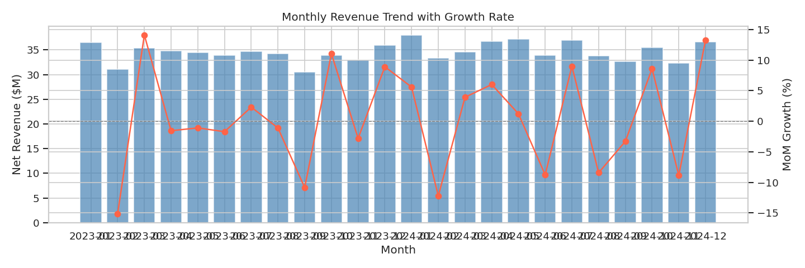
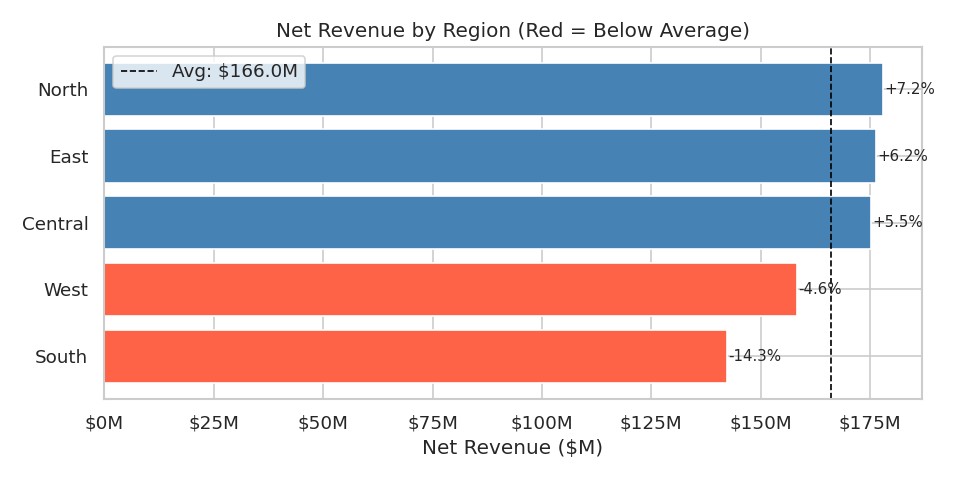
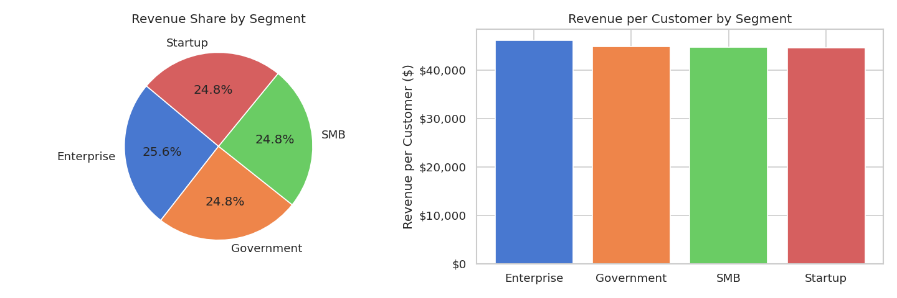
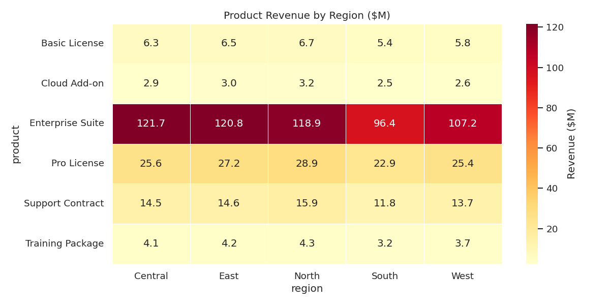
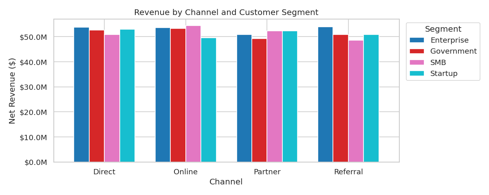

# Sales Performance & Revenue Analysis Dashboard

> **Stack:** Python · SQL (PostgreSQL) · Power BI  
> **Dataset:** 50,000 synthetic sales transactions across 2 years, 5 regions, 6 products  
> **Goal:** Identify revenue trends, surface underperforming regions, and support data-driven strategy through KPI dashboards

---

## Key Findings

| Metric | Value |
|---|---|
| Total Revenue (2023–2024) | $829,967,570 |
| Total Transactions | 50,000 |
| Unique Customers | 5,000 |
| Avg Order Value | $16,599 |
| Underperforming Region | **South (−14.3% vs avg)** |
| Top Segment (Rev/Customer) | **Enterprise — $46,194** |

---

## Project Structure

```
sales-dashboard/
│
├── data/
│   ├── generate_data.py       # Generates 50,000-row synthetic sales dataset
│   └── sales_data.csv         # Generated dataset (50k rows)
│
├── sql/
│   └── analysis_queries.sql   # 8 advanced SQL queries (CTEs, Window Functions, JOINs)
│
├── notebooks/
│   └── eda_analysis.py        # Python EDA — trends, segmentation, heatmaps
│
├── images/                    # Auto-generated charts
│   ├── 01_monthly_revenue_trend.png
│   ├── 02_regional_performance.png
│   ├── 03_customer_segmentation.png
│   ├── 04_product_region_heatmap.png
│   └── 05_channel_effectiveness.png
│
└── README.md
```

---

## SQL Analysis (`sql/analysis_queries.sql`)

8 queries covering all major analytical patterns:

| # | Query | Techniques Used |
|---|---|---|
| 1 | Monthly Revenue Trend | CTE, `LAG()`, `DATE_TRUNC` |
| 2 | Regional Performance vs Average | CTE, `CROSS JOIN`, `RANK()` |
| 3 | Customer Segmentation | CTE, `SUM() OVER()` |
| 4 | Product Revenue by Region | `PARTITION BY`, Running Total |
| 5 | Top 10% Customers | `NTILE(10)` |
| 6 | Sales Rep Leaderboard | `DENSE_RANK()`, `PARTITION BY` |
| 7 | Underperforming Regions MoM | `LAG()`, `PARTITION BY region` |
| 8 | Channel Effectiveness | Multi-level aggregation |

---

## Python EDA (`notebooks/eda_analysis.py`)

- Monthly revenue bar + MoM growth rate overlay
- Regional performance vs average (flags underperformers in red)
- Customer segmentation — revenue share pie + revenue per customer
- Product × Region revenue heatmap
- Channel effectiveness by customer segment

### Charts

**Monthly Revenue Trend**  


**Regional Performance**  


**Customer Segmentation**  


**Product × Region Heatmap**  


**Channel Effectiveness**  


---

## Power BI Dashboard

The Power BI `.pbix` file connects to `sales_data.csv` and includes 4 report pages:

| Page | KPIs Covered |
|---|---|
| **Executive Overview** | Total Revenue, MoM Growth, Transactions, AOV |
| **Regional Deep Dive** | Revenue by region, % vs average, MoM trend per region |
| **Product & Segment** | Revenue by product, segment share, discount impact |
| **Sales Rep Performance** | Leaderboard, deals closed, avg deal size |

> To use: Open `powerbi/Sales_Dashboard.pbix` in Power BI Desktop → update the CSV path in Transform Data.

---

## Setup

```bash
# Clone
git clone https://github.com/AaryendraKashyap/sales-dashboard.git
cd sales-dashboard

# Install dependencies
pip install pandas numpy matplotlib seaborn

# Generate dataset
cd data && python generate_data.py

# Run EDA
cd ../notebooks && python eda_analysis.py
```

For SQL: load `data/sales_data.csv` into PostgreSQL using `\COPY`, then run `sql/analysis_queries.sql`.

---

## Skills Demonstrated

- **Advanced SQL** — CTEs, Window Functions (`LAG`, `RANK`, `NTILE`, `PARTITION BY`), multi-table JOINs
- **Python / Pandas** — data wrangling, feature engineering, aggregation pipelines
- **Data Visualization** — Matplotlib, Seaborn, dual-axis charts, heatmaps
- **Business Insight** — identified South region as 14.3% below average, flagged February as worst MoM decline month
- **Power BI** — KPI cards, slicers, drill-through pages, DAX measures
